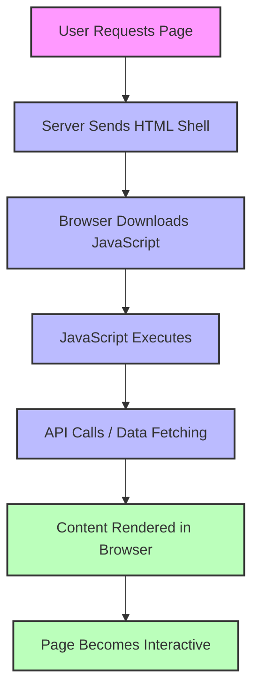
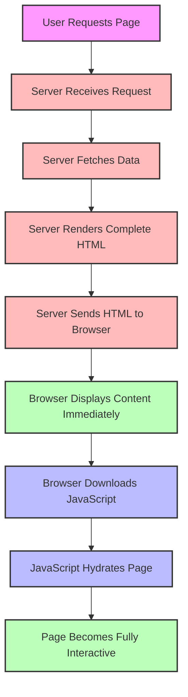
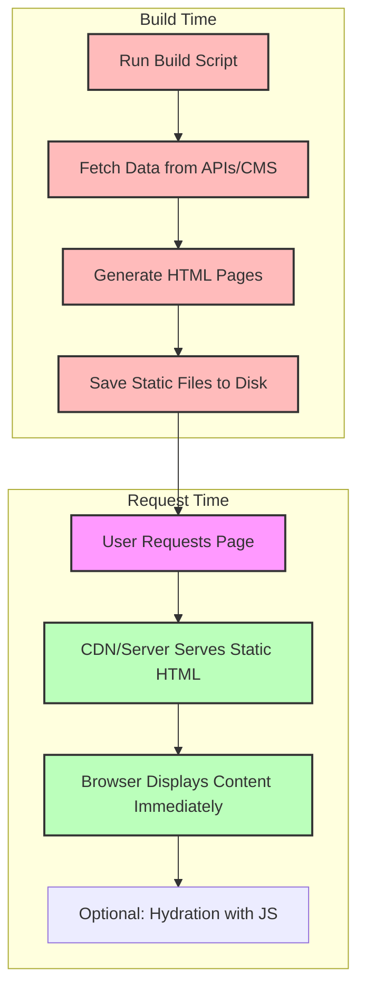
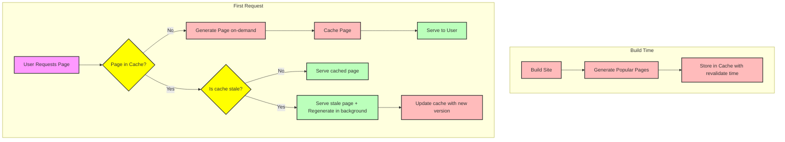
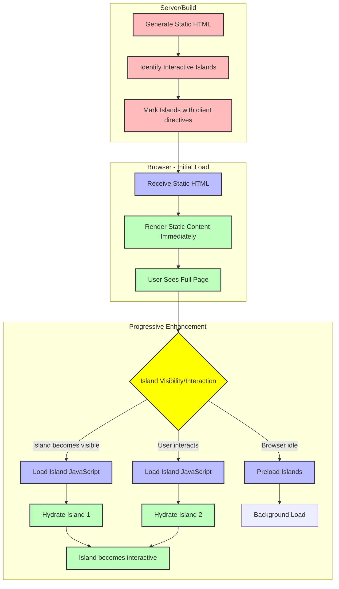
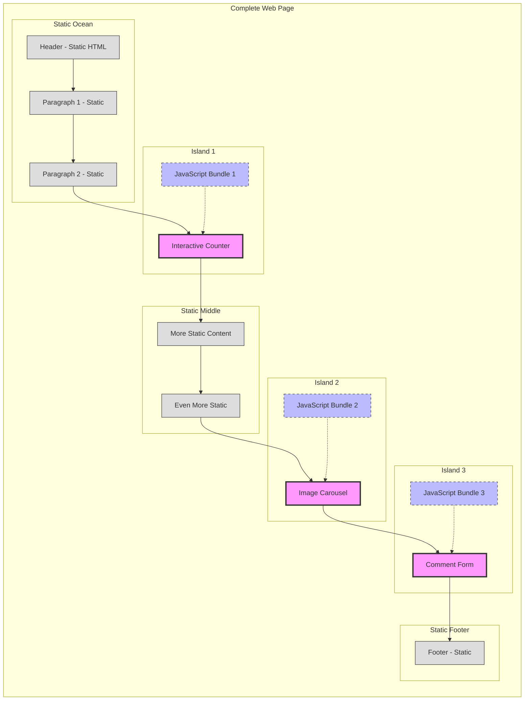
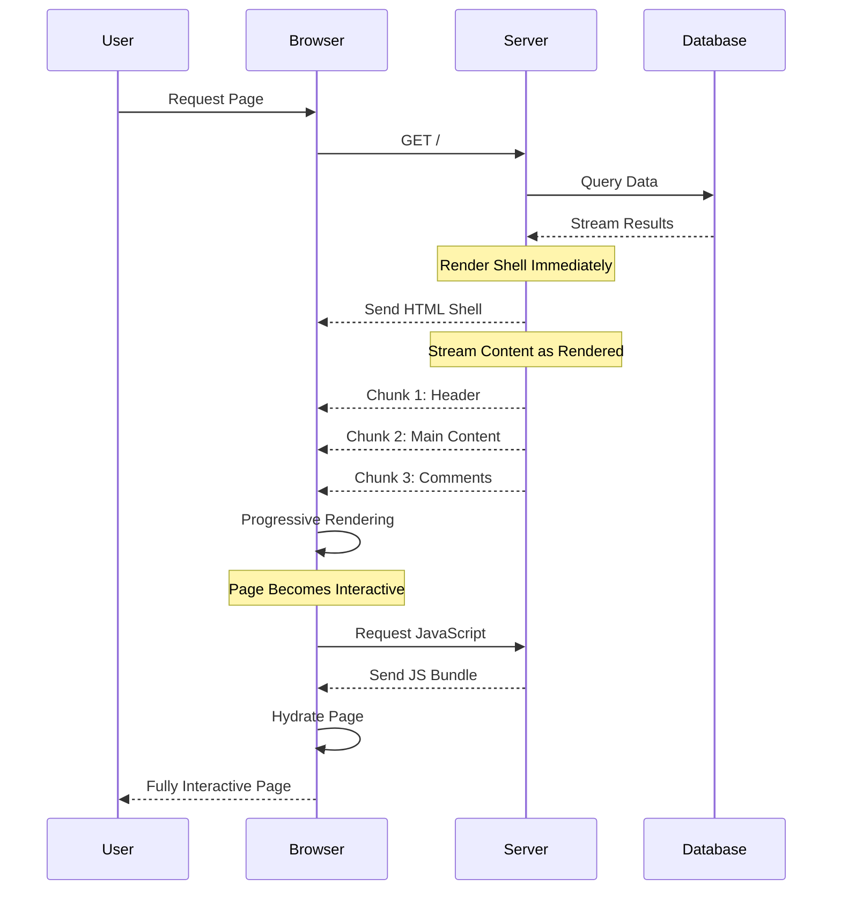

# Frontend Rendering Models

A comprehensive guide to understanding, comparing, and implementing various frontend rendering models in modern web development.


## 📚 Table of Contents

- [Overview](#overview)
- [Core Concepts](#core-concepts)
- [Traditional Rendering Models](#traditional-rendering-models)
- [Hybrid and Modern Approaches](#hybrid-and-modern-approaches)
- [Comparison Matrix](#comparison-matrix)
- [Framework Implementations](#framework-implementations)
- [Decision Guide](#decision-guide-when-to-use-what)
- [Performance Metrics](#performance-metrics)
- [SEO Implications](#seo-implications)
- [Code Examples](#code-examples)
- [Best Practices](#best-practices)
- [Future Trends](#future-trends)
- [Resources](#resources)
- [Contributing](#contributing)

## Overview

Frontend rendering models determine how and when HTML is generated and displayed in the browser. The choice of rendering model significantly impacts:

- **Performance**: Initial load time, time to interactive, and runtime performance
- **SEO**: How search engines index your content
- **User Experience**: Perceived speed and interactivity
- **Developer Experience**: Complexity of development and deployment
- **Scalability**: Server load and infrastructure requirements

## Core Concepts

Before diving into specific models, understand these fundamental concepts:

| Concept | Description |
|---------|-------------|
| **Hydration** | Process of attaching event listeners and making static HTML interactive |
| **Build Time** | When the application is compiled/deployed |
| **Request Time** | When a user requests a page |
| **Time to Interactive (TTI)** | When the page becomes fully interactive |
| **First Contentful Paint (FCP)** | When first content appears on screen |

## Traditional Rendering Models

### 1. Client-Side Rendering (CSR)

In CSR, the server sends a minimal HTML shell with JavaScript, and rendering happens entirely in the browser.

```html
<!-- Server sends minimal HTML -->
<!DOCTYPE html>
<html>
  <body>
    <div id="root"></div>
    <script src="bundle.js"></script>
  </body>
</html>
```

```javascript
// bundle.js - Renders content in browser
document.addEventListener('DOMContentLoaded', () => {
  const root = document.getElementById('root');
  fetch('/api/data')
    .then(res => res.json())
    .then(data => {
      root.innerHTML = `<h1>${data.title}</h1>`;
    });
});
```

**Flow Diagram:**


**Pros:**
- ✅ Rich site interactions
- ✅ Fast subsequent page loads
- ✅ Reduced server load
- ✅ Easy to deploy (static hosting)

**Cons:**
- ❌ Slow initial page load
- ❌ Poor SEO (crawlers may not wait for JS)
- ❌ Requires JavaScript to work
- ❌ Performance depends on client device

**Best For:** Dashboards, authenticated apps, highly interactive SPAs

### 2. Server-Side Rendering (SSR)

SSR generates complete HTML on the server for each request.

```javascript
// Server-side (Node.js/Express)
const express = require('express');
const app = express();

app.get('/', async (req, res) => {
  const data = await fetchData();
  const html = `
    <!DOCTYPE html>
    <html>
      <body>
        <h1>${data.title}</h1>
        <p>${data.content}</p>
        <script src="client.js"></script>
      </body>
    </html>
  `;
  res.send(html);
});
```

**Flow Diagram:**


**Pros:**
- ✅ Fast initial page load
- ✅ Excellent SEO
- ✅ Works without JavaScript (basic content)
- ✅ Better performance on slow devices

**Cons:**
- ❌ Higher server load
- ❌ Slower subsequent navigation
- ❌ More complex infrastructure
- ❌ Potential for server bottlenecks

**Best For:** E-commerce, dynamic content sites, SEO-critical pages

### 3. Static Site Generation (SSG)

SSG pre-builds HTML pages at deployment time.

```javascript
// build.js - Build-time script
const fs = require('fs');
const path = require('path');

async function buildSite() {
  // Fetch all posts at build time
  const response = await fetch('https://api.example.com/posts');
  const posts = await response.json();
  
  // Generate HTML for each post
  posts.forEach(post => {
    const html = `
      <!DOCTYPE html>
      <html>
        <body>
          <h1>${post.title}</h1>
          <p>${post.content}</p>
        </body>
      </html>
    `;
    
    const filePath = path.join(__dirname, 'dist', `${post.slug}.html`);
    fs.writeFileSync(filePath, html);
  });
}

buildSite();
```

**Flow Diagram:**


**Pros:**
- ✅ Extremely fast (served from CDN)
- ✅ Excellent SEO
- ✅ Very secure and reliable
- ✅ Minimal server costs

**Cons:**
- ❌ Content updates require rebuild
- ❌ Not suitable for dynamic/personalized content
- ❌ Long build times for large sites
- ❌ Less flexible for real-time data

**Best For:** Blogs, documentation, marketing sites, portfolios

## Hybrid and Modern Approaches

### 4. Incremental Static Regeneration (ISR)

ISR combines SSG with on-demand updates. Pages are generated at build time but can be updated incrementally.

```javascript
// Next.js ISR Example
export async function getStaticProps() {
  const data = await fetchData();
  return {
    props: { data },
    revalidate: 60 // Revalidate every 60 seconds
  };
}

export async function getStaticPaths() {
  const posts = await fetchPosts();
  const paths = posts.map(post => ({ params: { id: post.id } }));
  return { paths, fallback: 'blocking' };
}
```

**Flow Diagram:**


**Key Features:**
- 🔄 **Background Regeneration**: Update pages without rebuilding entire site
- ⚡ **On-demand Generation**: Generate rarely-accessed pages when requested
- 🎯 **Stale-while-revalidate**: Serve old content while fetching new
- 📦 **Partial Builds**: Only rebuild changed pages

**Pros:**
- ✅ Best of SSG (speed) and SSR (freshness)
- ✅ Scales to millions of pages
- ✅ Automatic cache invalidation
- ✅ Lower server costs than full SSR

**Cons:**
- ❌ Complex configuration
- ❌ First visit to new page may be slow
- ❌ Cache management complexity

**Best For:** Large e-commerce sites, CMS-driven sites, news sites

### 5. Universal/Isomorphic Rendering

Universal rendering uses the same code on server and client, combining SSR for initial load with CSR for subsequent interactions.

```jsx
// Universal React Component
function App({ initialData }) {
  const [data, setData] = useState(initialData);
  
  // Client-side only
  useEffect(() => {
    if (!initialData) {
      fetchData().then(setData);
    }
  }, []);
  
  return <div>{data.title}</div>;
}

// Server-side
const initialData = fetchDataSync();
const html = renderToString(<App initialData={initialData} />);

// Client-side (same component reuses initialData)
ReactDOM.hydrate(<App initialData={window.__INITIAL_DATA__} />, root);
```

**Key Concepts:**
- 🔄 **Code Sharing**: Same components run on server and client
- 📦 **State Transfer**: Server passes initial state to client
- ⚡ **Seamless Transition**: No flash of content change

**Pros:**
- ✅ Best of both worlds
- ✅ Consistent codebase
- ✅ Optimal user experience
- ✅ Great performance

**Cons:**
- ❌ Complex setup
- ❌ Careful coding required (avoid server/client mismatches)
- ❌ Higher server resource usage

### 6. Island Architecture / Partial Hydration

Island architecture renders most of the page as static HTML, with only specific interactive "islands" being hydrated.

```astro
---
// Astro Component Example
import InteractiveHeader from '../components/InteractiveHeader';
import ImageCarousel from '../components/ImageCarousel';
---

<!-- Static HTML - No JavaScript -->
<article>
  <h1>Blog Post Title</h1>
  
  <!-- Interactive Island - Hydrated -->
  <InteractiveHeader client:load />
  
  <!-- Static content -->
  <p>This is static content. No JavaScript needed!</p>
  
  <!-- Interactive Island - Hydrated when visible -->
  <ImageCarousel client:visible />
  
  <!-- More static content -->
  <p>Additional static content...</p>
</article>
```

**Visual Representation:**


**Island Architecture Visual Representation



**Key Features:**
- 🏝️ **Selective Hydration**: Only hydrate interactive components
- ⏰ **Lazy Loading**: Load islands based on visibility or interaction
- 🔋 **Minimal JavaScript**: Default to static HTML
- 🧩 **Framework Agnostic**: Islands can use different frameworks

**Pros:**
- ✅ Minimal JavaScript payload
- ✅ Fast initial paint
- ✅ Excellent performance metrics
- ✅ Progressive enhancement by default

**Cons:**
- ❌ Complex state sharing between islands
- ❌ Learning curve for new patterns
- ❌ Limited framework support

**Best For:** Content sites with interactive widgets, marketing pages, blogs

### 7. Streaming Server-Side Rendering

Streaming SSR sends HTML to the browser in chunks as it's generated.

```javascript
// React 18 Streaming SSR
import { renderToPipeableStream } from 'react-dom/server';

app.get('/', (req, res) => {
  const { pipe } = renderToPipeableStream(<App />, {
    bootstrapScripts: ['/client.js'],
    onShellReady() {
      res.setHeader('content-type', 'text/html');
      pipe(res);
    }
  });
});
```



**Benefits:**
- 📦 **Progressive Loading**: Show content as it renders
- 🚀 **Faster TTFB**: Start sending HTML immediately
- 🎯 **Prioritized Loading**: Critical content first

### 8. Progressive Hydration

Progressive hydration hydrates components in order of priority.

```javascript
// Prioritized hydration
const Header = lazy(() => import('./Header'), { priority: 'high' });
const Comments = lazy(() => import('./Comments'), { priority: 'low' });
const Footer = lazy(() => import('./Footer'), { priority: 'idle' });
```

## Comparison Matrix

| Model | Initial Load | TTI | SEO | Dynamic Content | Server Load | Complexity | Best For |
|-------|--------------|-----|-----|-----------------|-------------|------------|----------|
| **CSR** | 🟡 Slow | 🔴 Slowest | 🟡 Limited | 🟢 Excellent | 🟢 Low | 🟢 Simple | Dashboards, SPAs |
| **SSR** | 🟢 Fast | 🟡 Medium | 🟢 Excellent | 🟢 Excellent | 🔴 High | 🟡 Medium | E-commerce, Dynamic sites |
| **SSG** | 🟢 Fastest | 🟢 Fast | 🟢 Excellent | 🔴 Static | 🟢 Very Low | 🟢 Simple | Blogs, Docs |
| **ISR** | 🟢 Fast | 🟢 Fast | 🟢 Excellent | 🟡 Medium | 🟡 Medium | 🟡 Medium | Large e-commerce, CMS |
| **Islands** | 🟢 Fast | 🟢 Fast | 🟢 Excellent | 🟢 Excellent | 🟡 Medium | 🔴 Complex | Content + Widgets |
| **Streaming SSR** | 🟢 Fast | 🟡 Medium | 🟢 Excellent | 🟢 Excellent | 🔴 High | 🔴 Complex | Large pages |

## Framework Implementations

### React Ecosystem

| Framework | CSR | SSR | SSG | ISR | Islands | Special Features |
|-----------|-----|-----|-----|-----|---------|------------------|
| **Next.js** | ✅ | ✅ | ✅ | ✅ | Partial | App Router, Server Components |
| **Gatsby** | ✅ | ❌ | ✅ | ❌ | ❌ | GraphQL data layer |
| **Remix** | ✅ | ✅ | ✅ | ❌ | ❌ | Nested routes, Progressive enhancement |
| **Astro** | ✅ | ✅ | ✅ | ❌ | ✅ | Multi-framework islands |

### Vue Ecosystem

| Framework | CSR | SSR | SSG | ISR | Islands | Special Features |
|-----------|-----|-----|-----|-----|---------|------------------|
| **Nuxt** | ✅ | ✅ | ✅ | ✅ | ✅ | Auto-imports, Modules |
| **VitePress** | ❌ | ❌ | ✅ | ❌ | ❌ | Docs focused |
| **Quasar** | ✅ | ✅ | ✅ | ❌ | ❌ | UI components |

### Other Frameworks

| Framework | CSR | SSR | SSG | ISR | Islands | Special Features |
|-----------|-----|-----|-----|-----|---------|------------------|
| **SvelteKit** | ✅ | ✅ | ✅ | ✅ | Partial | Compiled framework |
| **Qwik** | ✅ | ✅ | ✅ | ❌ | ✅ | Resumability |
| **Angular Universal** | ✅ | ✅ | ❌ | ❌ | ❌ | Enterprise focused |
| **Eleventy** | ❌ | ❌ | ✅ | ❌ | ❌ | Static site generator |

## Decision Guide: When to Use What

### Choose CSR if:
- ✅ Building a highly interactive web application
- ✅ Users are authenticated (no SEO needed)
- ✅ Real-time updates are critical
- ✅ Deploying to static hosting
- ✅ Building internal tools/dashboards

### Choose SSR if:
- ✅ SEO is critical for dynamic content
- ✅ Need fast initial page loads
- ✅ Content changes frequently
- ✅ Users have slow devices
- ✅ Building e-commerce or content sites

### Choose SSG if:
- ✅ Content doesn't change often
- ✅ Need maximum performance
- ✅ Building documentation or blog
- ✅ Want minimal server costs
- ✅ Content can be fetched at build time

### Choose ISR if:
- ✅ Have thousands of pages
- ✅ Content updates regularly but not real-time
- ✅ Need SSG performance with fresh content
- ✅ Running an e-commerce platform
- ✅ Pages can be regenerated on-demand

### Choose Islands if:
- ✅ Mostly static content with interactive widgets
- ✅ Need best possible performance
- ✅ Want minimal JavaScript by default
- ✅ Progressive enhancement is priority
- ✅ Building content-focused sites

## Performance Metrics

### Core Web Vitals Impact

| Model | LCP | FID | CLS | TTI | FCP |
|-------|-----|-----|-----|-----|-----|
| CSR | 🔴 Poor | 🔴 Poor | 🟢 Good | 🔴 Poor | 🔴 Poor |
| SSR | 🟢 Good | 🟡 Fair | 🟢 Good | 🟡 Fair | 🟢 Good |
| SSG | 🟢 Excellent | 🟢 Good | 🟢 Good | 🟢 Good | 🟢 Excellent |
| ISR | 🟢 Good | 🟢 Good | 🟢 Good | 🟢 Good | 🟢 Excellent |
| Islands | 🟢 Excellent | 🟢 Good | 🟢 Good | 🟢 Good | 🟢 Excellent |

### Performance Optimization Tips

**For CSR:**
```javascript
// Code splitting
const AdminPanel = React.lazy(() => import('./AdminPanel'));

// Preload critical resources
<link rel="preload" href="critical.js" as="script">

// Tree shaking (Webpack)
module.exports = {
  mode: 'production',
  optimization: {
    usedExports: true
  }
};
```

**For SSR:**
```javascript
// Cache rendered pages
const cache = new Map();

app.get('/', async (req, res) => {
  if (cache.has('home')) {
    return res.send(cache.get('home'));
  }
  const html = await renderToString(<Home />);
  cache.set('home', html);
  res.send(html);
});
```

**For SSG/ISR:**
```javascript
// next.config.js
module.exports = {
  experimental: {
    incrementalCacheHandler: './cache-handler.js'
  }
};
```

## SEO Implications

### How Search Engines See Each Model

| Model | Googlebot View | Indexing Speed | Dynamic Content |
|-------|---------------|----------------|-----------------|
| CSR | May see empty page | Slow | JavaScript required |
| SSR | Full HTML immediately | Fast | Immediate |
| SSG | Full HTML immediately | Fastest | Build-time only |
| ISR | Full HTML immediately | Fast | Near real-time |
| Islands | Full HTML immediately | Fast | Partial |

## Code Examples

### Basic CSR Example

```html
<!-- index.html -->
<!DOCTYPE html>
<html>
<body>
  <div id="app"></div>
  <script src="app.js"></script>
</body>
</html>
```

```javascript
// app.js
document.addEventListener('DOMContentLoaded', async () => {
  const app = document.getElementById('app');
  
  // Show loading state
  app.innerHTML = '<div>Loading...</div>';
  
  try {
    const response = await fetch('/api/data');
    const data = await response.json();
    
    app.innerHTML = `
      <h1>${data.title}</h1>
      <p>${data.description}</p>
      <button onclick="handleClick()">Click me</button>
    `;
    
    // Make interactive
    window.handleClick = () => alert('Clicked!');
  } catch (error) {
    app.innerHTML = '<div>Error loading data</div>';
  }
});
```

### Basic SSR Example (Node.js)

```javascript
// server.js
const express = require('express');
const app = express();

app.get('/', async (req, res) => {
  // Fetch data on server
  const response = await fetch('https://api.example.com/data');
  const data = await response.json();
  
  // Generate HTML on server
  const html = `
    <!DOCTYPE html>
    <html>
    <head>
      <title>${data.title}</title>
      <meta name="description" content="${data.description}">
    </head>
    <body>
      <h1>${data.title}</h1>
      <p>${data.description}</p>
      <button onclick="handleClick()">Click me</button>
      
      <script>
        window.__INITIAL_DATA__ = ${JSON.stringify(data)};
      </script>
      <script src="client.js"></script>
    </body>
    </html>
  `;
  
  res.send(html);
});

app.listen(3000);
```

### Island Architecture Example (Astro)

```astro
---
// pages/index.astro
import Header from '../components/Header.astro';
import InteractiveCounter from '../components/InteractiveCounter.jsx';
import NewsletterSignup from '../components/NewsletterSignup.jsx';
import Footer from '../components/Footer.astro';
---

<html>
<head>
  <title>My Site with Islands</title>
</head>
<body>
  <!-- Static components - No JS -->
  <Header />
  
  <main>
    <h1>Welcome to my site</h1>
    <p>This is all static HTML. Fast to load, great for SEO.</p>
    
    <!-- Interactive Island - Loads immediately -->
    <div class="widget-area">
      <InteractiveCounter client:load />
    </div>
    
    <!-- Interactive Island - Loads when visible -->
    <div class="sidebar">
      <NewsletterSignup client:visible />
    </div>
  </main>
  
  <!-- Static footer -->
  <Footer />
</body>
</html>
```

```jsx
// components/InteractiveCounter.jsx
import { useState } from 'react';

export default function InteractiveCounter() {
  const [count, setCount] = useState(0);
  
  return (
    <div className="counter">
      <h3>Interactive Counter</h3>
      <p>Count: {count}</p>
      <button onClick={() => setCount(count + 1)}>
        Increment
      </button>
    </div>
  );
}
```

### ISR Example (Next.js)

```javascript
// pages/products/[id].js
export default function Product({ product }) {
  return (
    <div>
      <h1>{product.name}</h1>
      <p>Price: ${product.price}</p>
      <p>{product.description}</p>
    </div>
  );
}

// Generate static paths at build time
export async function getStaticPaths() {
  const products = await fetch('https://api.example.com/products').then(r => r.json());
  
  const paths = products.slice(0, 100).map(product => ({
    params: { id: product.id.toString() }
  }));
  
  return { paths, fallback: 'blocking' };
}

// Fetch data for each product
export async function getStaticProps({ params }) {
  const product = await fetch(`https://api.example.com/products/${params.id}`).then(r => r.json());
  
  return {
    props: { product },
    revalidate: 3600 // Revalidate every hour
  };
}
```

### Streaming SSR Example (React 18)

```javascript
// server.js
import express from 'express';
import { renderToPipeableStream } from 'react-dom/server';
import App from './App.jsx';

const app = express();

app.get('/', (req, res) => {
  res.setHeader('Content-Type', 'text/html');
  
  // Start streaming
  const { pipe } = renderToPipeableStream(<App />, {
    bootstrapScripts: ['/client.js'],
    onShellReady() {
      res.write(`
        <!DOCTYPE html>
        <html>
        <head><title>Streaming SSR</title></head>
        <body>
        <div id="root">
      `);
      
      pipe(res);
      
      res.write(`
        </div>
        </body>
        </html>
      `);
    }
  });
});

app.listen(3000);
```

## Best Practices

### 1. Measure Before Optimizing

```javascript
// Use Performance API
performance.mark('start-render');
// ... render code ...
performance.mark('end-render');
performance.measure('render-time', 'start-render', 'end-render');

// Monitor long tasks
const observer = new PerformanceObserver((list) => {
  for (const entry of list.getEntries()) {
    console.log('Long task:', entry.duration);
  }
});
observer.observe({ entryTypes: ['longtask'] });
```

### 2. Implement Proper Caching Strategies

```javascript
// Browser caching headers
res.setHeader('Cache-Control', 'public, max-age=3600');

// Service worker caching
self.addEventListener('fetch', (event) => {
  event.respondWith(
    caches.match(event.request)
      .then(response => response || fetch(event.request))
  );
});
```

### 3. Progressive Enhancement

```html
<!-- Always provide base functionality -->
<button class="interactive-btn">Click me</button>

<!-- Enhance with JavaScript -->
<script>
if (document.querySelector('.interactive-btn')) {
  import('./enhanced-button.js');
}
</script>
```

## Future Trends

### 1. Edge Rendering
Rendering at CDN edge locations for minimal latency.

```javascript
// Next.js Edge Runtime
export const config = {
  runtime: 'edge'
};

export default function handler(req) {
  return new Response(
    JSON.stringify({ message: 'Rendered at edge' }),
    {
      headers: { 'content-type': 'application/json' }
    }
  );
}
```

### 2. React Server Components
Components that run exclusively on the server.

```jsx
// Server Component - no JS sent to client
async function Note({ id }) {
  const note = await db.notes.get(id);
  return (
    <div>
      <h2>{note.title}</h2>
      <p>{note.content}</p>
    </div>
  );
}
```

### 3. Resumability (Qwik)
Instead of hydration, applications can be serialized and resumed.

```tsx
// Qwik component
import { component$, useSignal } from '@builder.io/qwik';

export const Counter = component$(() => {
  const count = useSignal(0);
  
  return (
    <button onClick$={() => count.value++}>
      {count.value}
    </button>
  );
});
```

## Resources

### Documentation
- [Next.js Documentation](https://nextjs.org/docs)
- [Astro Documentation](https://docs.astro.build)
- [Qwik Documentation](https://qwik.builder.io/docs)
- [React Documentation](https://react.dev)

### Articles
- [Rendering on the Web](https://web.dev/rendering-on-the-web/)
- [Islands Architecture](https://jasonformat.com/islands-architecture/)
- [The New Wave of JavaScript Frameworks](https://www.patterns.dev/posts/islands-architecture/)

### Tools
- [Lighthouse](https://developers.google.com/web/tools/lighthouse)
- [WebPageTest](https://www.webpagetest.org/)
- [BundlePhobia](https://bundlephobia.com/)

## Contributing

Contributions are welcome! Please read the [contributing guidelines](CONTRIBUTING.md) before submitting PRs.

### How to Contribute
1. Fork the repository
2. Create a feature branch
3. Make your changes
4. Submit a pull request

## License

This project is licensed under the MIT License - see the [LICENSE](LICENSE) file for details.

## Acknowledgments

- The web development community for continuous innovation
- Framework authors and contributors
- All contributors to this repository

---

**⭐ Star this repository if you find it helpful!**

[Twitter](https://twitter.com/yourhandle) | [Discord](https://discord.gg/example) | [GitHub](https://github.com/yourusername/frontend-rendering-models)
